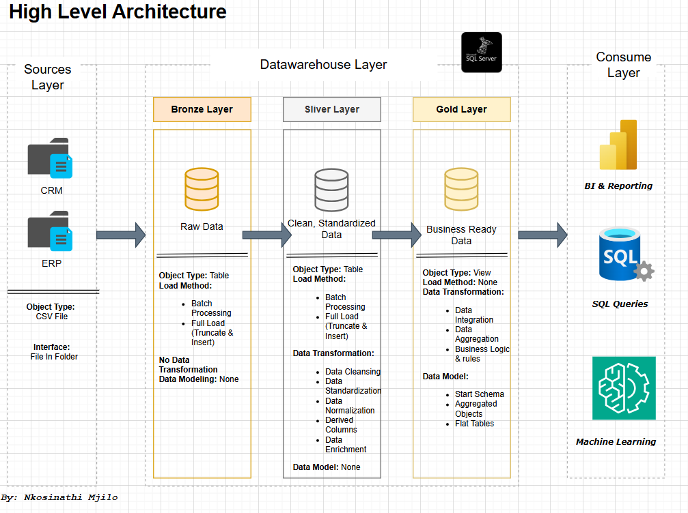

# First Data Warehouse & Analytics Project 
(Enspired by DataWithBaraa)
- To view him here is his link for GitHub: https://github.com/DataWithBaraa
---
Designing a SQL Server data warehouse 🗄️ with ETL pipelines 🔄, data modeling 📐, and analytics 📊 using Medallion Architecture 🥇🥈🥉
---

## 🏗️ Data Architecture
For this project, a **Data Warehouse** architecture was selected over a **Data Lake** and **Data Lakehouse**. The solution leverages the **Medallion Architecture** approach, chosen for its structured layers, flexibility, and simplicity - enabling scalable, maintainable, and efficient data processing.

Here is the High Level Architecture view below:

---
#### 🚀 Objective
Develop a modern Data Warehouse using SQL Server to consolidate sales data, enabling analytical reporting 📊 and data-driven decision-making 💡.

#### 🛠️ Specifications

- **📂 Data Sources**: Import data from two source systems (ERP & CRM) provided as CSV files.

- **🧹 Data Quality**: Cleanse, standardize, and resolve data quality issues prior to analysis.

- **🔗 Integration**: Combine both data sources into a single, user-friendly data model optimized for analytical queries.

- **📌 Scope**: Focus on the latest available dataset only — historization is not required.

- **📖 Documentation**: Provide clear and structured documentation of the data model to support both business stakeholders and analytics teams.

---

### 📊 BI: Analytics & Reporting
#### 🎯 Objective
Develop SQL-based analytics and reporting solutions to generate valuable business insights into:

- **👥 Customer Behaviour**

- **📦 Product Performance**

- **📈 Sales Trends**

These insights empower stakeholders with key business metrics, supporting strategic and informed decision-making.

## 📜 License
This project is licensed under the MIT License.

## 👨‍💻 About Me
Hello! 👋
I’m Nkosinathi Vusumuzi Mjilo, currently working as a Credit Analyst with experience in Marketing Analytics and Operational Analytics.
I am passionate about Data Science and continuously expanding my skills across the entire data ecosystem, including:

🏛️ Data Architecture

⚙️ Data Engineering

📊 Data Analytics

🤖 Data Science

**My long-term goal is to become a highly skilled Data Scientist capable of handling the complete end-to-end data pipeline. 🚀**
